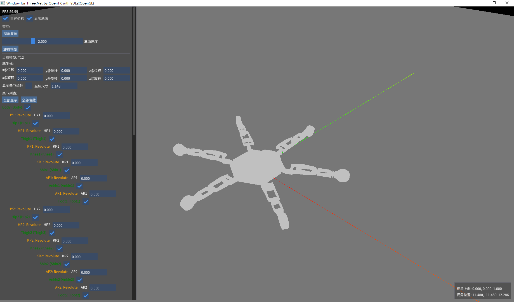

# URDF Visualizer

This project is a visualizer for URDF (https://wiki.ros.org/urdf).

## Introduction

- Based on .Net 7.0 (a personal preference for that .Net nowadays is quite cross-platform friendly).
- Render 3D with `THREE` (https://github.com/hjoykim/THREE), a C# port of three.js, which makes a light-weight 3D environment. 
- Display and interactive with `SDL2` (https://github.com/flibitijibibo/SDL2-CS) window, which makes it more cross-platform (yet only tested on Windows). THREE takes `OpenTK` (https://github.com/opentk/opentk) as backend graphical library.
- Use `ImGUI.Net` (https://github.com/mellinoe/imgui.net) for interaction. A updated implementation for ImGUI with SDL2 and OpenTK is taken.
- The URDF is loaded with the `urdf-loader`. It's inspired by `urdf-loaders` (https://github.com/gkjohnson/urdf-loaders). The implementation by urdf-loaders is designed in C# for Unity which is not avaliable in this project. Therefore, urdf-loader makes a new implmented based on urdf-loaders for THREE environment.
- Project is well origanized that one could easily extend or implement new usages with SDL2, THREE or ImGUI.Net.

## Folders
- ImGui.3D: The main entry.
- imgui-sdlcs: ImGUI environment with SDL2.
- urdf-loader: A loader of URDF with THREE environment.

## Demo

The URDF used for demo could be found at the repository of urdf-loaders (https://github.com/gkjohnson/urdf-loaders/tree/master/urdf/T12) .

NOTE: This version of ImGUI.3D need chinese font for displaying, you should found `NotoSansSC-Regular.ttf` from https://fonts.google.com/noto/specimen/Noto+Sans+SC and put it under ImGui.3D/ .
